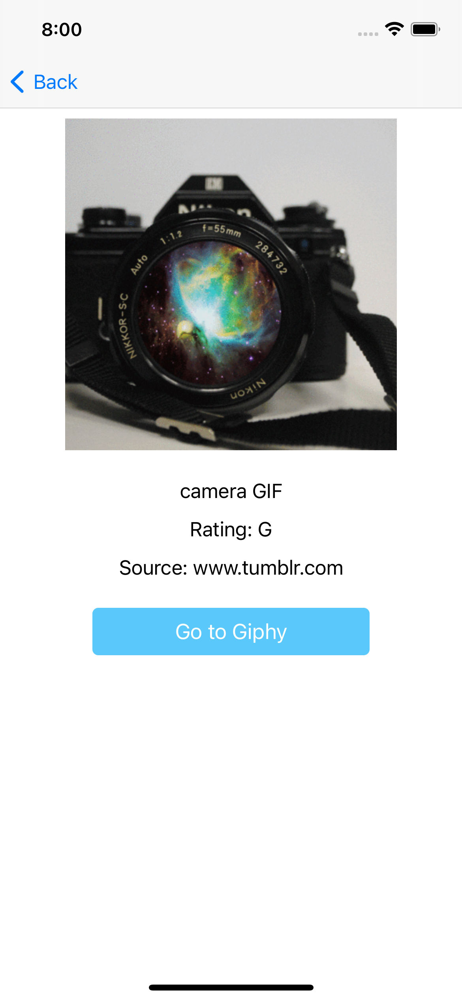

# Giphy Explorer

A Simple app in list view that allows you to browse and search Giphy. Data is fetched from the [Giphy API](https://developers.giphy.com/).

## Tech Stack
The app uses Combine framework and SnapLKit to layout views.

## Functionalities
When there is no query, the view displays the featured gifs. When there is a query, it displays the search results from the API.

Tapping on a cell goes the Detail View of a Giphy, which requests and displays detailed information includes
-  title, 
- rating
- source tld
- a button that opens web browser to the Giphy page

## Screenshots

